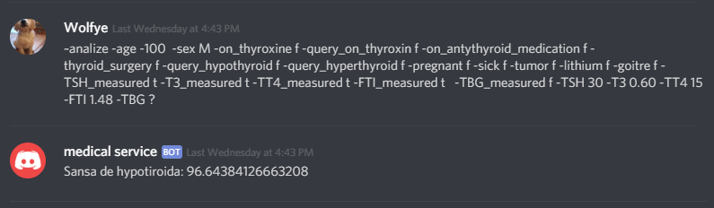

# MedicalAI 
# Profesori coordonatori:
- Bibicu Dorin 
- Tudor Veronica
# Realizat de:
- Pamint Andrei-Florin  
- Horovei Iulian-Valentin 
# Motivația lucrării 
Una din problemele actuale în domeniul sănătății este presiunea adusă organelor responsabile atât de influxul mare de pacienți cât și de numărul redus de personal. Rezultatul principal este creșterea timpului de așteptare pentru pacienți. Rolul principal al acestei lucrări a fost introducerea unei methode de fluidizare și reducere a timpului petrecut de către pacienți prin asistarea procedeului de procesare al analizelor endocrinologice. Putem exemplifica acesta folosind următorul scenariu. În momentul actual este estimat că aproximativ 83000 de pacienți au fost diagnosticați cu diverse boli ale tiroidei. Un alt element cunoscut este faptul că aprox. 40% din populația lumii este expusă deficitului de iod, un factor cu influență negativă asupra tiroidei. În cazul unui eveniment ce ar necesită un control obligatoriu, cum a fost cazul exploziei de la Cernobîl, putem specula stresul adăugat sistemelor de procesare.
 
# Tehnologii folosite 
## Pentru intelgienta arficiala au fost folosite:
- Python3 
- Tensorflow 
- Keras 
- Numpy 
## Pentru server au fost folosite:
- Python3 
- SQLlite 
- secrets 
- SSL 
## Pentru bot-ul de discord au fost folosite:
- Python3
-discord
-SSl
## Pentru site au fost folosite: 
- HTML
- PHP
- JavaScript
## Pentru client au fost folosite:
- C#
- MetroFramework
- CircularProgressBar
- Newtonsoft.Json
# Structura 
## Bot-ului de discord
Pentru a folosi bot-ul de discord trebuie invitat pe un server cu urmatorul url : https://discordapp.com/oauth2/authorize?client_id=497399313379491880&scope=bot&permissions=0
Dupa ce a fost invitat, pentru a trimite analize spre interpretare se va folosi formula 

` \~analize -age? -sex? -on\_thyroxine? -query\_on\_thyroxin? -on\_antythyroid\_medication? -thyroid\_surgery? -query\_hypothyroid? -query\_hyperthyroid? -pregnant? -sick? -tumor? -lithium? -goitre? -TSH\_measured? -T3\_measured? -TT4\_measured? -FTI\_measured? -TBG\_measured? -TSH? -T3? -TT4? -FTI? -TBG? `

Toate semnele de întrebare trebuie înlocuite cu valori corespunzătoare,prezentate în descrierea bot-ului  

## Clientul de Windows
[Pentru a folosi clientul de windows trebuie descărcat proiectul de pe următorul github: https://github.com/pamintandrei/Tiroidaptinfoed/tree/master/TiroidaClient][2]Prima pagină a programului este formată din:Formulare de logare;Buton de reținere a datelor de logare;Buton pentru încercarea aplicației fără cont de utilizator;Buton pentru înregistrarea unui utilizator;Buton de logare.  Pagina de înregistrare.Această este compusă din 4 câmpuri.Email-ul o să fie folosit pentru un cod de verificare al contului.Toate datele sunt trimise pe server criptat. Pagina de confirmare a contului.Aceasta este formata dintr-un singur camp în care trebuie introdus codul de confirmare primit pe email.   Pagina de încercare a aplicatiei si pagina de trimitere a analizelor sunt identice. Acestea sunt formate din 24 de campuri reprezentand datele necesare pentru interpretare.  Pagina de vizualizare a analizelor.Aceasta se activeaza doar cand utilizatorul este logat.Pe aceasta pagina sunt prezentate analizele din baza de date.În viitor aceasta pagina va putea fi accesata doar de catre doctorii autorizați. _Site-ul web._ Acesta are aceasi structura ca și pagina de analize a aplicatiei de pe Windows.  
# Utilitate
Din această prezentare se poate observă asistență dată de softul creat. Folosind aceast program un client poate verifică necesitatea planificării unui control medical, astfel reducând procentul de pacienți ce necesită verificare. Un alt avantaj adus de acest soft este prezența pe o multitudine de platforme, necesitând doar o conectiune la internet. Clientul este disponibil pe sistemul de operare Windows.Bot-ul este disponibil pe discord care are ca și platforme susținute:MAC,iOS,Windows,Linux,Android.Site-ul web este disponibil pe orice aplicație browser.    
# Oportunitati de dezvoltare
Primul pas pe care vrem sa il facem e sa introducem funcționalitatea doctorilor de a vedea si interacționa cu analizele pacienților.
O alta funcție ar fi cea de a putea planifica programările direct in aplicație. 
Dupa finalizarea bazei programului o sa adăugăm mai mulți algoritmi de detectare a afecțiunilor bazate pe analize. 
Grafica clientului de windows trebuie imbunatațita. 
Trebuie sa adăugăm funcționalitațile aplicației windows si pe site-ul web. [1]: https://discordapp.com/oauth2/authorize?client_id=497399313379491880&scope=bot&permissions=0 [2]: https://github.com/pamintandrei/Tiroidaptinfoed/tree/master/TiroidaClient
