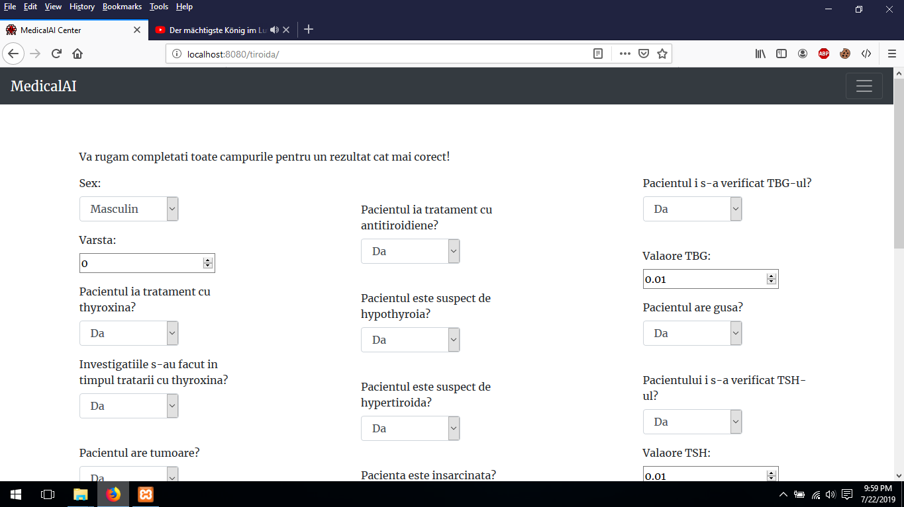

# MedicalAI 
[Romanian version](https://github.com/pamintandrei/Tiroidaptinfoed#profesori-coordonatori)

[English version](https://github.com/pamintandrei/Tiroidaptinfoed#coordinated-by)
## Profesori coordonatori:
- Bibicu Dorin 
- Tudor Veronica
## Realizat de:
- Pamint Andrei-Florin  
- Horovei Iulian-Valentin 
## Motivația lucrării 
Una din problemele actuale în domeniul sănătății este presiunea adusă organelor responsabile atât de influxul mare de pacienți cât și de numărul redus de personal. Rezultatul principal este creșterea timpului de așteptare pentru pacienți. Rolul principal al acestei lucrări a fost introducerea unei metode de fluidizare și reducere a timpului petrecut de către pacienți prin asistarea procesului de examinare al analizelor. Putem exemplifica acesta folosind următorul scenariu:Până la 24% din populația lumii o să fie diagnosticată cu diverse boli ale tiroidei. În cazul unui eveniment ce ar necesită un control obligatoriu, cum a fost cazul exploziei de la Cernobîl, putem specula stresul adăugat sistemelor de procesare.

 
# Tehnologii folosite 
## Pentru intelgienta arficiala au fost folosite:
- Python3 
- Tensorflow 
- Keras 
- Numpy 
## Pentru server au fost folosite:
- Python3 
- SQLlite 
- secrets 
- SSL 
## Pentru bot-ul de discord au fost folosite:
- Python3
- discord
- SSl
## Pentru site au fost folosite: 
- HTML
- CSS
- PHP
- JavaScript
## Pentru client au fost folosite:
- C#
- MetroFramework
- CircularProgressBar
- Newtonsoft.Json

# Justificarea tehnologiilor folosite
Tensorflow si Keras au fost folosite datorita usurintei de modificare si testare a retelelor neuronale.
C# impreuna cu framework-ul .NET au fost folosite datorita mediului intuitiv de dezvoltare al aplicatiei si pentru compatibilitatea cu alte sisteme de operare Windows.
Tehnologia SSL a fost folosita pentru securizarea comunicarii server-client si pentru prevenirea atacurilor MITM.

# Structura 
## Bot-ului de discord

Dupa ce a fost invitat, pentru a verifica hypotiroida/hypertiroida se va folosi comanda:

` \~analize -age? -sex? -on\_thyroxine? -query\_on\_thyroxin? -on\_antythyroid\_medication? -thyroid\_surgery? -query\_hypothyroid? -query\_hyperthyroid? -pregnant? -sick? -tumor? -lithium? -goitre? -TSH\_measured? -T3\_measured? -TT4\_measured? -FTI\_measured? -TBG\_measured? -TSH? -T3? -TT4? -FTI? -TBG? `

Toate semnele de întrebare trebuie înlocuite cu valori corespunzătoare,prezentate în descrierea bot-ului 

 

Pentru a verifica o poza se va trimite poza incluzand boala acesteia prin comanda:
~pneumonia [poza]
~tuberculoza [poza]
~bleeding [poza]
~breast [poza]
~leukemia [poza]
~malaria [poza]
~parkinson [poza]

[pozaaaa]

## Clientul de Windows
Pentru a folosi clientul de windows trebuie descărcat proiectul de pe următorul github: https://github.com/pamintandrei/Tiroidaptinfoed/tree/master/TiroidaClient
Prima pagină a programului este formată din:
Formulare de logare;Buton de reținere a datelor de logare;Buton pentru încercarea aplicației fără cont de utilizator;Buton pentru înregistrarea unui utilizator;Buton de logare.

 

Pagina de înregistrare.
Această este compusă din 4 câmpuri.Email-ul o să fie folosit pentru un cod de verificare al contului.Toate datele sunt trimise pe server criptat.

 

Pagina de confirmare a contului.
Aceasta este formata dintr-un singur camp în care trebuie introdus codul de confirmare primit pe email. 

 

Pagina de încercare a aplicatiei si pagina de trimitere a analizelor sunt identice. Acestea sunt formate din 24 de campuri reprezentand datele necesare pentru interpretare. 

Pagina de vizualizare a analizelor.Aceasta se activeaza doar cand utilizatorul este logat.Pe aceasta pagina sunt prezentate analizele din baza de date.

 

Pagina de examinare a pozelor. Selectarea afectiunii se realizeaza printr-un dropbox, poza poate fi pusa in doua moduri: prin folosirea butonului "Cauta poza..." sau prin functia drag & drop. 

[upload_photo]

## Site-ul web 
Are aceasi structura ca si pagina de analizelor pentru hypotiroida/hypertiroida si pentru analizarea pozelor precum aplicatia.

 

[poza_web]

# Utilitate
Din această prezentare se poate observă asistență dată de softul creat. Folosind aceast program un client poate verifică necesitatea planificării unui control medical, astfel reducând procentul de pacienți ce necesită verificare.

Un alt avantaj adus de acest soft este prezența pe o multitudine de platforme, necesitând doar o conectiune la internet.

Clientul este disponibil pe sistemul de operare Windows.

Bot-ul este disponibil pe discord care are ca și platforme susținute:MAC,iOS,Windows,Linux,Android.

Site-ul web este disponibil pe orice aplicație browser. 

 

 

 

# Instalare

## Instalarea serverului AI
Acesta poate fi instalat pe Windows sau Linux. Recomandam folosirea programului "Anaconda" pentru a simplifica procesul de instalare a librariilor necesare:

socket
threading
json
keras
tensorflow
numpy
sqlite3
secrets
smtplib
ssl
base64
hashlib
imghdr
shutil
numba

Serverul se poate activa folosind comanda in Linux "python server_versiune_2.7.py".

## Instalarea web serverului
Acesta se instaleaza folosind orice web server, precum nginx sau apache2.
Dupa instalarea web serverului se vor copia fisierele necesare de pe link-ul https://github.com/pamintandrei/MedicalAI/tree/master/webserver si se vor pune in folderul serverului.

## Instalarea botului de Discord
Pentru instalarea acestui bot se vor copia fisierele necesare de pe link-ul https://github.com/pamintandrei/MedicalAI/tree/master/DiscoTiro si se va configura fisierul auth.json cu token-ul necesar, generat de pe pagina necesara https://discordapp.com/developers/applications/ .

## Instalarea Clientului de Windows
Acesta este foarte usor de instalat, trebuie copiate fisierele din https://github.com/pamintandrei/MedicalAI/tree/master/TiroidaClient/Tiroida/bin/Release si se va executa. Pentru configurarea ip-ului si port-ului se va folosi aplicatia.

# Chestionar pentru analizarea pietei
83,9% din raspunsuri fac doar o data sau niciodata analize generale in timpul unui an. Din acestia 73,1% au raspuns ca nu au nevoie, insa pana la 24% din populatie o sa afectiuni endocrinologice. 
90,3% din raspunsuri ar fi dispusi sa creasca numarul de analize daca s-ar rula un program national care ar face analize generale gratuite interpretare de o inteligenta artificiala.
Pe o scara de la 0 la 10, media de incredere in diagnosticul provizoriu pus de catre un algoritm este 7.58
* Numerele sunt luate pe data de 21.07.2019, Ora 9:10
https://docs.google.com/spreadsheets/d/1dxcpg4uXPbk8lugaMnV8x4NDSaJpH7PmLw5nIFl99pg/edit#gid=1671088322

# Distributia rolurilor

## Pamint Andrei-Florin
- Crearea retelelor neuronale
- Legarea retelelor neuronale la server
- Unele functii folosite pentru baza de date
- Modificarea structurii bazei de date
- Crearea chestionarului

## Horovei Iulian-Valentin
- Crearea webserverului
- Crearea aplicatiei Windows
- Conceperea si crearea serverului TCP
- Crearea bot-ului de Discord
- Implementarea unor functii pentru baza de date

# Oportunitati de dezvoltare
- Grafica clientului de windows trebuie adaptata pe baza feedback-ului
- Adaugarea mai multor retele neuronale
- Discutarea cu un spital privat sau public pentru integrarea aplicatiei in sistemul lor

## Coordinated by:
- Bibicu Dorin 
- Tudor Veronica
## Made by:
- Pamint Andrei-Florin  
- Horovei Iulian-Valentin 

## The motivation behind the application
One of the problems in the Romanian medical system is the pressure put on the doctors on one hand by the massive influx of patients and on the other the low number of doctors. The result of this being the long waits when making an appointment. The primary role of this application is the introduction of a way to make the whole system smoother and to reduce the time spent in queues with a way to process endocrinological data.We can exemplify this using the following scenario. Currently it’s estimated that 83.000 patients have been diagnosticated with different thyroid diseases. Another known fact is that around 40% of the population is exposed to iodine deficit, a factor that plays a big part in the thyroid diseases. In case of obligatory check-up, for example in case of a nuclear disaster like the one at Chernobyl.

 

# Technologies used
## For the neural network:
- Python3 
- Tensorflow 
- Keras 
- Numpy 
## For the server:
- Python3 
- SQLlite 
- secrets 
- SSL 
## For the discord bot:
- Python3
- discord
- SSl
## For the website: 
- HTML
- PHP
- JavaScript
## For the windows app:
- C#
- MetroFramework
- CircularProgressBar
- Newtonsoft.Json

# Structure 
## The discord bot.
To use the discord bot you need to invite him to a server with the following link:  https://discordapp.com/oauth2/authorize?client_id=497399313379491880&scope=bot&permissions=0
After he was invited, to send the data you need to use the following command: 

` \~analize -age? -sex? -on\_thyroxine? -query\_on\_thyroxin? -on\_antythyroid\_medication? -thyroid\_surgery? -query\_hypothyroid? -query\_hyperthyroid? -pregnant? -sick? -tumor? -lithium? -goitre? -TSH\_measured? -T3\_measured? -TT4\_measured? -FTI\_measured? -TBG\_measured? -TSH? -T3? -TT4? -FTI? -TBG? `

All the question marks need to switched to data like in the bot description. 

 

## The windows app.
You can find the windows app right in this folder:  https://github.com/pamintandrei/Tiroidaptinfoed/tree/master/TiroidaClient

 

 

## The webpage.
 

# Utility
From this presentation it can be seen the assistance provided by the app. Using this app you can check if you need a check-up, this way we reduce the number of patients in the queue. 
Another advantage is the cross-platform nature of the app, only needing a stable connection to the internet.
The app is available on Windows. The Discord bot is available on all the Discord supported devices: MAC; iOS; Windows; Linux; Android. Our website is available to all the browsers.

 

 

 

# Development roadmap
What we presented is the base function of our app. Our future plans are:

•	Adding more neural networks to analyse more dieses

•	Improving the user interface

•	Adding a way for the user to plan a medical check-up

